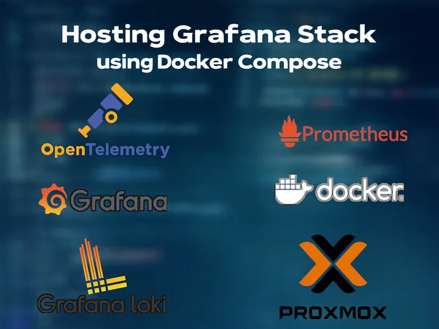
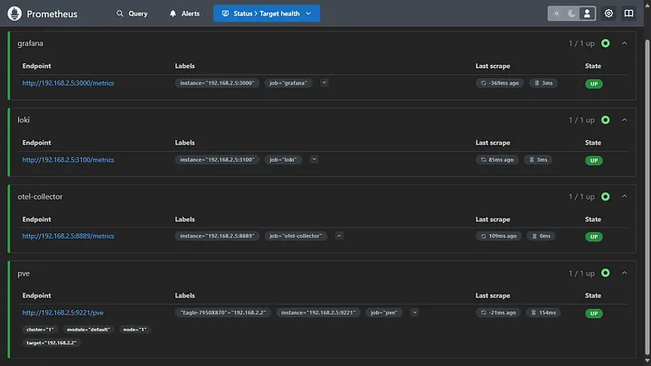
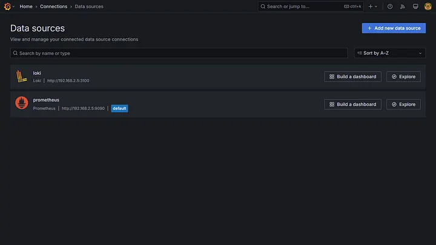
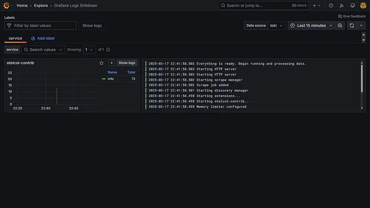
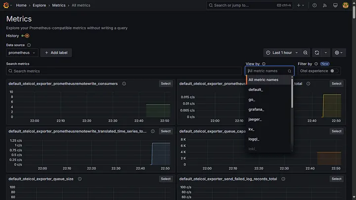
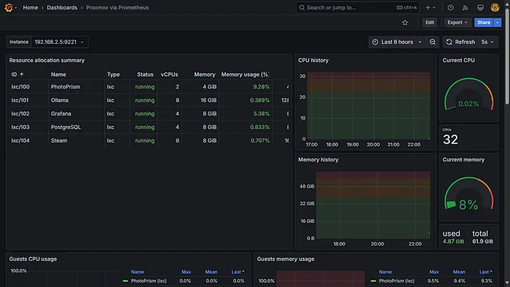
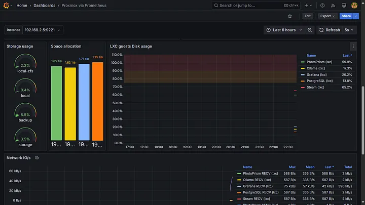

## Goal

This article serves as a beginner’s guide to hosting services in standalone mode for personal use. It aims to provide a clear understanding of the architecture of each service and the most suitable configurations. While the guide offers a foundational setup, the configuration can be modified to meet specific requirements.

The script used in the article is available [here](#installation-script).

## Motivation

Managing logs and metrics efficiently is crucial for maintaining visibility into system performance. I needed a centralized monitoring system to aggregate data from various applications and services running on my server. The goal was simple: consolidate logs and metrics into a single, scalable system that could seamlessly integrate with future projects.

Initially, I considered the LGTM stack Loki, Grafana, Promtail and Prometheus where Promtail serves as the log aggregator. However, Promtail is being deprecated and would eventually lose support. This led me to explore Grafana Alloy, but despite significant effort, I could not get it to function correctly in my setup. Hence, for aggregation, I opted for the OpenTelemetry Collector due to its native support for multiple data sources, flexible architecture and seamless application instrumentation.

However, deploying and configuring the stack was far from straightforward. Despite the abundance of documentation, very few resources focus on hosting services in a standalone environment. The configuration of Loki, Prometheus and OpenTelemetry and orchestrating them together was particularly challenging due to the extensive number of tuneable parameters.

Despite the initial hurdles, choosing OpenTelemetry proved beneficial in future proofing the system because of its support for various deployment modes.

***

## Deployment Patterns for OpenTelemetry Collector

OpenTelemetry can be deployed in three ways:

1. **No Collector Mode**: Applications send telemetry data directly to monitoring backends.  
   - Pros: Simplifies setup; reduces infrastructure overhead.  
   - Cons: Limited flexibility; lacks processing capabilities.  
   - Best for: Small scale applications with direct integration.

2. **Agent Mode**: A lightweight instance runs alongside applications, collecting and forwarding telemetry data.  
   - Pros: Reduces application load; provides better resilience.  
   - Cons: Requires deployment on each node.  
   - Best for: Scenarios needing localized data collection and minimal overhead.

3. **Gateway Mode**: A centralized collector ingests data from multiple agents before forwarding it to storage solutions.  
   - Pros: Enhances scalability and flexibility; supports aggregation and enrichment.  
   - Cons: Introduces a single point of failure (unless deployed redundantly).  
   - Best for: Large scale distributed systems requiring high availability.

I decided to go with the agent mode, setting up an OpenTelemetry Collector.

## OpenTelemetry Collector Architecture

The OpenTelemetry Collector processes telemetry data through a pipeline consisting of four main components:

1. **Receivers**: Ingest telemetry data from various sources (for example OTLP, Prometheus, Loki).  
2. **Processors**: Modify, filter and batch data before exporting it.  
3. **Exporters**: Send processed data to backends like Loki, Prometheus, or external monitoring platforms.  
4. **Connectors**: Bridge different data sources and sinks for better integration.

Besides these pipeline components, **extensions** provide additional capabilities such as health checks, diagnostic tools and authentication mechanisms. Once configured, services must be explicitly enabled within the `service` section of the configuration file to function correctly.

***

## Configuration of OpenTelemetry Collector

1. **Configuring receivers**  

Receivers determine how the OpenTelemetry Collector ingests telemetry data. They are configured in the `receivers` section. Many receivers have default settings, allowing them to be configured simply by specifying their name. If customization is required, you can modify the configuration in this section. Any specified settings override the default values, if applicable.

```yaml
receivers:
  otlp:
    protocols:
      http:
        endpoint: "0.0.0.0:4318" # Endpoint for receiving OTLP over HTTP

  otlp/loki:
    protocols:
      http:
        endpoint: "0.0.0.0:4317" # Endpoint for receiving Logs for Loki exporter

  prometheus:
    config:
      scrape_configs:
        - job_name: otel-collector
          static_configs:
            - targets:  # Prometheus scrape target for OpenTelemetry Collector
```

The OpenTelemetry Collector exposes its metrics on `localhost:8888`, which are then ingested by the Prometheus receiver on the same host. These metrics are subsequently exported using an exporter on port `8889`.

*It is essential to keep track of all port numbers to properly configure Docker and ensure access to them.*

2. **Configuring processors**

Processors manage and control the flow of telemetry data within the OpenTelemetry Collector. They take data from receivers, modify or transform it, and then pass it to exporters. Processing follows predefined rules or settings, which may include filtering, dropping, renaming, or recalculating telemetry, among other operations. The sequence of processors in a pipeline dictates the order in which these transformations are applied to the signal.

In my case, I had no such requirements, so I did not define any processors. However, configuring a `memory_limiter` and a `batch` processor is essential.

2.1 **The `memory_limiter` processor**

The `memory_limiter` helps prevent out of memory situations. As the collector processes various data types, its memory usage can fluctuate depending on the environment and workload. By implementing the `memory_limiter` processor, especially as the first processor in a pipeline, you can safeguard the system against unexpected spikes and maintain smoother operations.

```yaml
processors:
  memory_limiter:
    check_interval: 1s # Check memory limits every 1 second
    limit_percentage: 50 # Limit memory usage to the percentage of available memory (hard limit)
    spike_limit_percentage: 30 # Limit memory usage to the percentage of available memory (soft limit)

  batch:
```

If memory consumption exceeds the `limit_percentage` (hard limit), the system forces garbage collection to free up memory. However, if it surpasses the `spike_limit_percentage` (soft limit), it starts rejecting new data to prevent further strain. The `memory_limiter` helps prevent system crashes, ensuring that as much data as possible is processed without permanent loss while effectively managing backpressure.

2.2 **The `batch` processor**

The `batch` processor collects spans, metrics, or logs and organises them into batches. Batching improves data compression and minimises the number of outgoing connections needed for transmission. This processor supports both size based and time based batching.

I have used the default configuration for the processor. You can find the various configuration parameters [in the official documentation](https://github.com/open-telemetry/opentelemetry-collector/blob/main/processor/batchprocessor/README.md).

3. **Configuring exporters**

Exporters transmit data to one or more backends or destinations. They can operate in either a pull or push model and may support multiple data sources. Each entry in the `exporters` section defines an exporter instance. The key follows the `type/name` format, where `type` specifies the exporter type (for example `otlp`, `kafka`, `prometheus`) and `name` (optional) provides a unique identifier for multiple instances of the same type. You can find an extensive list of supported exporters [in the official documentation](https://opentelemetry.io/docs/languages/python/exporters/).

```yaml
exporters:
  otlphttp:
    endpoint: "http://${HOST}:3100/otlp" # Export logs to Loki via OTLP

  loki:
    endpoint: "http://${HOST}:3100/loki/api/v1/push" # Export logs to Loki via API

  prometheus:
    endpoint: "0.0.0.0:8889" # Expose Prometheus metrics endpoint
    namespace: default # Namespace for the metrics

  prometheusremotewrite:
    endpoint: "http://${HOST}:9090/api/v1/write" # Remote write to Prometheus
    tls:
      insecure: true # Allow insecure TLS connections
```

However, simply configuring an exporter does not enable it. Exporters must be explicitly added to the appropriate pipelines within the `service` section to be active.

4. **Configuring services**

The `service` section configures which components are enabled in the Collector based on the settings defined in the `receivers`, `processors`, `exporters` and `extensions` sections. If a component is configured but not referenced within the `service` section, it remains disabled.

The `service` section consists of three subsections:

- **Extensions**: Extensions are optional components that enhance the functionality of the Collector. While they do not directly process or modify telemetry data, they provide valuable features such as health monitoring, service discovery and authentication.  
- **Pipelines**: Pipelines define the flow of logs and metrics in the Collector: receivers → processors → exporters. A receiver, processor, or exporter can be used in multiple pipelines. When a processor is referenced in multiple pipelines, each pipeline receives its own separate instance. The configuration follows the `type/[name]` syntax, similar to other components.  
- **Telemetry**: The `telemetry` configuration section enables observability for the Collector itself. You can find more information about it [in the official documentation](https://opentelemetry.io/docs/collector/internal-telemetry/#activate-internal-telemetry-in-the-collector).

```yaml
service:
  pipelines:
    logs/otlp:
      receivers: [otlp] # Use OTLP receiver for logs
      processors: [memory_limiter, batch]
      exporters: [otlphttp]

    logs/loki:
      receivers: [otlp/loki] # Use Loki Exporter for logs
      processors: [memory_limiter, batch]
      exporters: [loki]

    metrics:
      receivers: [otlp, prometheus] # Use OTLP and Prometheus receivers for metrics
      processors: [memory_limiter]
      exporters: [prometheus, prometheusremotewrite]

  telemetry:
    logs:
      processors:
        - batch:
      exporter:
        otlp:
          protocol: http/protobuf
          endpoint: "http://${HOST}:4318"
```

In this configuration, two separate pipelines handle logs: one uses OTLP over HTTP, while the other supports the deprecated Loki Exporter.

For metrics, the OpenTelemetry Collector’s own metrics and those received via OTLP over HTTP are exported to Prometheus using `prometheus` and `prometheusremotewrite`, respectively. Additional configuration is required when setting up the Docker container [check here](#configuration-of-proxmox-ve-exporter).

The logs generated by the OpenTelemetry Collector are ingested into Loki through the OTLP over HTTP receiver, using the `telemetry` service configuration.

***

## Configuration of Loki

Loki is a highly efficient, horizontally scalable log aggregation system developed by Grafana Labs. Loki is designed to be cost effective by indexing only metadata while storing log content as compressed chunks. This architecture makes it an ideal choice for observability.

Loki functions optimally for different use cases, whether for small scale local logging or highly available, distributed deployments. I configure Loki to run as a standalone application.

```yaml
auth_enabled: false # Disable authentication

server:
  http_listen_port: 3100 # HTTP port for the server to listen on
```

Since I deployed the service in a local environment within a trusted network, authentication was disabled. However, if authentication is required, consider enabling it through reverse proxies like NGINX. While Loki itself does not provide built in authentication, it integrates well with external authentication mechanisms to secure access effectively.

```yaml
common:
  instance_addr: "$HOST" # Address at which the instance can be reached by other Loki instances
  path_prefix: /loki # Prefix for all HTTP endpoints
  storage:
    filesystem:
      chunks_directory: /loki/chunks # Directory to store chunks in
      rules_directory: /loki/rules # Directory to store rules in
  replication_factor: 1 # Number of replicas of each log entry
  ring:
    kvstore:
      store: inmemory # Key value store for the ring
```

In a typical configuration, `instance_addr` specifies the address that other Loki instances use to communicate with this instance, while `path_prefix` is useful when running Loki behind a reverse proxy or within a subpath of a URL. These settings are particularly relevant for a publicly hosted distributed setup.

Loki stores logs in chunks instead of individual log lines. The `chunks_directory` is where these log chunks are stored. The `rules_directory` is where Loki alerting rules are stored.

The `ring` is a crucial component for deploying Loki in a distributed environment. It is a distributed key value store that tracks which Loki ingesters own specific data. It plays a crucial role in managing data distribution across multiple Loki instances in a cluster by handling sharding, distribution, query routing, replication and failure recovery.

For a standalone deployment, configuring the ring and replication factor is not essential, as a single ingester handles all logs, with no sharding or distributed query execution.

```yaml
schema_config:
  configs:
    - from: 2025-01-01 # Start of the time range for which the schema applies
      store: tsdb # Store logs in a tsdb
      object_store: filesystem # Store object in the filesystem
      schema: v13 # Schema version
      index:
        prefix: index_ # Prefix for the index files
        period: 24h # Period for the index files
```

Loki supports multiple schema versions; if migrating from an old Loki version, older schemas may also be defined, which can be achieved by specifying the start date of the particular schema version using `from`.

The `tsdb` (Time Series Database) is the most efficient storage backend for Loki. Older backends (`boltdb-shipper`) are deprecated. It improves query performance and reduces memory usage compared to older `boltdb-shipper`.

`object_store: filesystem` defines where the log chunks are stored. Since this is a standalone deployment, the logs will be stored on local disk.

The `index` `prefix` and `period` define the prefix for index files and frequency of creating new index files. For low volumes of logs, the `period` should be increased and lowered for high volume logs.

```yaml
limits_config:
  allow_structured_metadata: true # Allow structured metadata

analytics:
  reporting_enabled: false # Disable reporting
```

The `limits_config` section in Loki is used to control resource usage and feature restrictions. Loki requires `allow_structured_metadata: true` when you send logs directly with metadata (for example via OpenTelemetry or JSON logs). Without it, Loki ignores or strips the structured metadata, making it impossible to filter logs based on fields like `app`, `env`, or `level`.

`reporting_enabled: false` disables telemetry reporting to Grafana Labs. Keeping it `false` is recommended for privacy.

***

## Configuration of Prometheus

Configuring the Prometheus scraper is one of the easiest steps in the entire setup. To get started, I set up Prometheus to scrape metrics from other components of the stack and the Proxmox hypervisor.

```yaml
global:
  scrape_interval: 1s # Default frequency to scrape targets
  evaluation_interval: 15s # Default frequency to evaluate rules
```

I set the global `scrape_interval` to `1s`, which is a bit aggressive but useful for near real time monitoring. However, you should adjust the interval based on your requirements and system constraints. Similarly, Prometheus evaluates its alerting and recording rules according to the interval defined by `evaluation_interval`.

```yaml
scrape_configs:
  - job_name: 'pve'
    static_configs:
      - targets:
          - "$PVE_NODE" # Proxmox VE node.
    metrics_path: /pve # Endpoint to scrape Proxmox VE metrics
    params:
      module: [default]
      cluster: ['1']
      node: ['1']
    relabel_configs:
      - source_labels: [__address__]
        target_label: __param_target
      - source_labels: [__param_target]
        target_label: Eagle-7950X870
      - target_label: __address__
        replacement: "$HOST:9221" # PVE exporter.

  - job_name: "loki"
    static_configs:
      - targets: ["$HOST:3100"]

  - job_name: "otel-collector"
    static_configs:
      - targets: ["$HOST:8889"]

  - job_name: "grafana"
    metrics_path: "/metrics" # Endpoint to scrape Grafana metrics
    static_configs:
      - targets: ["$HOST:3000"]
```

**Prometheus scrapers**

1. `prometheus-pve-exporter`  

   The job `pve` scrapes metrics exposed by the `prometheus-pve-exporter`. The configuration is fairly simple, where you define the target nodes by specifying the IP address of the Proxmox server and its endpoints. For a single node, defining the `cluster` and `node` parameters is not necessary.

2. **Loki**  

   Loki is running on port `3100`, and Prometheus collects its metrics.

3. **OpenTelemetry Collector**  

   OpenTelemetry Collector exposes Prometheus metrics on port `8889`.

4. **Grafana**  

   Grafana exposes its metrics on a Prometheus compatible endpoint at `/metrics` on port `3000`.

***

## Configuration of Proxmox VE Exporter

To export the metrics of the Proxmox hypervisor, create a PVE user with read only access to collect metrics. Attach the PVEAuditor role to a group and add the user in the group.

```yaml
default:
  user: prometheus-pve-exporter@pve # Proxmox VE user
  password: $PROMETHEUS_PVE_EXPORTER_PASSWORD # Proxmox VE password
  verify_ssl: false # Disable SSL verification
```

I created a user `prometheus-pve-exporter` and disabled SSL verification as I have no TLS certificate.

***

## Deployment using Docker Compose

After configuring all the services, finally we can get started with deployment.

1. The Docker Compose file defines the following components:  
   - Loki (log aggregation)  
   - Prometheus (metrics collection)  
   - Prometheus PVE Exporter (Proxmox VE metrics)  
   - OpenTelemetry Collector (logs and metrics processing)  
   - Grafana (visualisation and dashboards)  

2. All the containers pull the latest image and are set to restart on failure and system boot.  

3. They are configured to run as non root users with appropriate user groups and access rights, ensuring secure access to specified host directories via bind mounts (more on this later). This enhances security while maintaining controlled access to necessary resources.  

4. Configuration files are mounted as volumes to maintain consistency and ease of management across deployments.  

5. Persistent storage is configured where applicable to retain data across restarts, preventing data loss.  

6. Essential services are defined with explicit dependencies to ensure proper startup order, reducing failures caused by unavailable dependencies.  

7. Network ports are mapped for external accessibility.

```yaml
services:
  loki:
    image: grafana/loki:latest # Use the official Loki image
    container_name: loki # Container name for Loki
    restart: unless-stopped # Restart the container automatically if it stops
    user: "999:1000" # Run as specified user
    ports:
      - "3100:3100" # Expose Loki on port 3100
      - "9095:9095" # Inter instance communication on port 9095
    volumes:
      - /loki:/loki # Persist Loki data to the host
      - /etc/loki/local-config.yaml:/etc/loki/local-config.yaml # Mount the configuration file

  prometheus-pve-exporter:
    image: prompve/prometheus-pve-exporter:latest # Use the official Prometheus PVE Exporter image
    container_name: prometheus-pve-exporter # Container name for Prometheus PVE Exporter
    init: true # Run the container as an init process
    restart: unless-stopped # Restart the container automatically if it stops
    user: "996:1001" # Run as specified user
    ports:
      - "9221:9221" # Expose Prometheus PVE Exporter on port 9221
    volumes:
      - "/etc/prometheus/pve.yml:/etc/prometheus/pve.yml" # Mount the configuration file
    depends_on: # Ensure Prometheus is started before Prometheus PVE Exporter
      - prometheus

  prometheus:
    image: prom/prometheus:latest # Use the official Prometheus image
    container_name: prometheus # Container name for Prometheus
    restart: unless-stopped # Restart the container automatically if it stops
    user: "996:1001" # Run as specified user
    ports:
      - "9090:9090" # Expose Prometheus on port 9090
    volumes:
      - /prometheus:/prometheus # Persist Prometheus data to the host
      - /etc/prometheus/prometheus.yaml:/etc/prometheus/prometheus.yaml # Mount the configuration file
    command:
      - "--config.file=/etc/prometheus/prometheus.yaml" # Specifies the location of the Prometheus configuration file
      - "--storage.tsdb.path=/prometheus" # Defines location to store tsdb data on disk
      - "--web.enable-lifecycle" # Reload Prometheus configuration without restarting the container
      - "--web.enable-remote-write-receiver" # Allows remote write requests from external sources

  otel-collector:
    image: otel/opentelemetry-collector-contrib:latest
    container_name: otel-collector
    init: true # Run the container as an init process
    restart: unless-stopped # Restart the container automatically if it stops
    user: "994:1003" # Run as specified user
    volumes:
      - /etc/otelcol-contrib/config.yaml:/etc/otelcol-contrib/config.yaml # Mount OpenTelemetry Collector configuration
    ports:
      - "8889:8889" # Expose OpenTelemetry Collector's metrics
      - "4318:4318" # OTLP HTTP receiver
      - "4317:4317" # OTLP HTTP receiver for Loki exporter

  grafana:
    image: grafana/grafana:latest # Use the official Grafana image
    container_name: grafana # Container name for Grafana
    restart: unless-stopped # Restart the container automatically if it stops
    user: "995:1002" # Run as specified user
    ports:
      - "3000:3000" # Expose Grafana on port 3000
    volumes:
      - /var/lib/grafana:/var/lib/grafana # Persist Grafana data to the host
    depends_on: # Ensure dependent services are started before Grafana
      - loki
      - prometheus
      - otel-collector
```

1. By default, Prometheus only scrapes metrics from configured targets. Enabling the `--web.enable-remote-write-receiver` flag allows external sources (such as OpenTelemetry, other Prometheus instances, or third party tools) to push metrics into Prometheus via the Remote Write API. Prometheus will expose an API endpoint at:

   `http://${HOST}:9090/api/v1/write`

2. The `--web.enable-lifecycle` flag allows Prometheus to reload its configuration without restarting the container or process. When this flag is enabled, Prometheus exposes a special HTTP endpoint:

   `http://<prometheus-server>:9090/-/reload`

   Sending a `POST` request to this endpoint makes Prometheus reload its configuration dynamically, meaning it applies changes to scrape jobs, alerting rules, or remote write settings without downtime.

***

## Deployment Challenges

Once all services were configured, I encountered another set of hurdles:

1. `permission denied` errors when containers tried to access host bind mounts. Running containers as root would have solved the issue, but this is an anti pattern and a serious security risk.

To resolve this:

- Created separate users and groups for each service.  
- Assigned appropriate permissions to only the required directories.  
- Configured UID and GID mappings in Docker Compose to enforce proper access control.

```bash
# Create necessary directories for Grafana, Loki, Prometheus, and OpenTelemetry
mkdir -p /etc/loki /etc/otelcol-contrib /etc/prometheus /loki /prometheus /var/lib/grafana

# Create users and groups for each service
groupadd loki-group
useradd -r -g loki-group loki-user

groupadd prometheus-group
useradd -r -g prometheus-group prometheus-user

groupadd grafana-group
useradd -r -g grafana-group grafana-user

groupadd otel-group
useradd -r -g otel-group otel-user

# Set ownership and permissions for directories
chown loki-user:loki-group /etc/loki /loki
chmod u=rwx,g=rx,o= /etc/loki /loki

chown prometheus-user:prometheus-group /etc/prometheus /prometheus
chmod u=rwx,g=rx,o= /etc/prometheus /prometheus

chown grafana-user:grafana-group /var/lib/grafana
chmod u=rwx,g=rx,o= /var/lib/grafana

chown otel-user:otel-group /etc/otelcol-contrib
chmod u=rwx,g=rx,o= /etc/otelcol-contrib
```

2. `http://192.168.2.5:3100/otlp/v1/logs` responded with HTTP status code `404 Not Found`.

Despite configuring everything correctly, requests to the endpoint kept returning a `404 Page Not Found` error. It was incredibly frustrating, as despite my meticulous attention to detail, the system simply refused to function as expected.

While searching online for context, I came across related issues reported on the official GitHub repositories of Loki and OpenTelemetry Collector ([issue `14238`](https://github.com/grafana/loki/issues/14238) and [issue `34233`](https://github.com/open-telemetry/opentelemetry-collector-contrib/discussions/34233) respectively).

I have a habit of always pulling the latest container image unless specific dependencies require otherwise. Since this system had no prior dependencies or legacy integrations, I proceeded as usual.

*This was the root cause of the issue.*  

Native OTEL support for Loki was introduced in the `version 3.0`. However, for some reasons, `version 2.9.9` was published after the `version 3.1.0`, making the `latest` image the `version 2.9.9`.

With the release of future versions, this issue is expected to be resolved. *(As of writing this article, the issue still persists.)*

***

Once all the services are up and running, check the status of Prometheus targets by accessing `http://host:9090/targets`. You should see all the targets up and running.



Once you log into Grafana, add the data sources. Now you can explore the logs and metrics.



Now you can explore the logs and metrics.





You can create or import dashboards for visualisation. For instance, I imported the [Proxmox via Prometheus](https://grafana.com/grafana/dashboards/10347-proxmox-via-prometheus/) dashboard to visualise all the metrics collected from the Proxmox hypervisor.





***

## Installation script 

```bash
#!/bin/bash

# Host IPv4 address
HOST=""
# Proxmox IPv4 address
PVE_NODE=""
# Password of PVE user with read-only access (PVEAuditor role)
PROMETHEUS_PVE_EXPORTER_PASSWORD=""

# Create necessary directories for Grafana, Loki, Prometheus, and OpenTelemetry
mkdir -p /etc/loki /etc/otelcol-contrib /etc/prometheus /loki /prometheus /var/lib/grafana

# Create users and groups for each service
groupadd loki-group
useradd -r -g loki-group loki-user

groupadd prometheus-group
useradd -r -g prometheus-group prometheus-user

groupadd grafana-group
useradd -r -g grafana-group grafana-user

groupadd otel-group
useradd -r -g otel-group otel-user

# Set ownership and permissions for directories
chown loki-user:loki-group /etc/loki /loki
chmod u=rwx,g=rx,o= /etc/loki /loki

chown prometheus-user:prometheus-group /etc/prometheus /prometheus
chmod u=rwx,g=rx,o= /etc/prometheus /prometheus

chown grafana-user:grafana-group /var/lib/grafana
chmod u=rwx,g=rx,o= /var/lib/grafana

chown otel-user:otel-group /etc/otelcol-contrib
chmod u=rwx,g=rx,o= /etc/otelcol-contrib

# Loki configuration
cat <<EOF > /etc/loki/local-config.yaml
auth_enabled: false # Disable authentication

server:
  http_listen_port: 3100 # HTTP port for the server to listen on

common:
  instance_addr: "$HOST" # Address at which the instance can be reached by other Loki instances
  path_prefix: /loki # Prefix for all HTTP endpoints
  storage:
    filesystem:
      chunks_directory: /loki/chunks # Directory to store chunks in
      rules_directory: /loki/rules # Directory to store rules in
  replication_factor: 1 # Number of replicas of each log entry
  ring:
    kvstore:
      store: inmemory # Key-value store for the ring

schema_config:
  configs:
    - from: 2025-01-01 # Start of the time range for which the schema applies
      store: tsdb # Store logs in a tsdb
      object_store: filesystem # Store object in the filesystem
      schema: v13 # Schema version
      index:
        prefix: index_ # Prefix for the index files
        period: 24h # Period for the index files

limits_config:
  allow_structured_metadata: true # Allow structured metadata

analytics:
  reporting_enabled: false # Disable reporting
EOF

# Prometheus configuration
cat <<EOF > /etc/prometheus/prometheus.yaml
global:
  scrape_interval: 1s # Default frequency to scrape targets
  evaluation_interval: 15s # Default frequency to evaluate rules

scrape_configs:
  - job_name: 'pve'
    static_configs:
      - targets:
          - "$PVE_NODE" # Proxmox VE node.
    metrics_path: /pve # Endpoint to scrape Proxmox VE metrics
    params:
      module: [default]
      cluster: ['1']
      node: ['1']
    relabel_configs:
      - source_labels: [__address__]
        target_label: __param_target
      - source_labels: [__param_target]
        target_label: Eagle-7950X870
      - target_label: __address__
        replacement: "$HOST:9221" # PVE exporter.

  - job_name: "loki"
    static_configs:
      - targets: ["$HOST:3100"]

  - job_name: "otel-collector"
    static_configs:
      - targets: ["$HOST:8889"]

  - job_name: "grafana"
    metrics_path: "/metrics" # Endpoint to scrape Grafana metrics
    static_configs:
      - targets: ["$HOST:3000"]
EOF

# Proxmox VE Exporter configuration
cat <<EOF > /etc/prometheus/pve.yml
default:
  user: prometheus-pve-exporter@pve # Proxmox VE user
  password: $PROMETHEUS_PVE_EXPORTER_PASSWORD # Proxmox VE password
  verify_ssl: false # Disable SSL verification
EOF

# OpenTelemetry Collector configuration
cat <<EOF > /etc/otelcol-contrib/config.yaml
receivers:
  otlp:
    protocols:
      http:
        endpoint: "0.0.0.0:4318" # Endpoint for receiving OTLP over HTTP

  otlp/loki:
    protocols:
      http:
        endpoint: "0.0.0.0:4317" # Endpoint for receiving Logs for Loki exporter

  prometheus:
    config:
      scrape_configs:
        - job_name: otel-collector
          static_configs:
            - targets:  # Prometheus scrape target for OpenTelemetry Collector

processors:
  memory_limiter:
    check_interval: 1s # Check memory limits every 1 second
    limit_percentage: 50 # Limit memory usage to the percentage of available memory (hard limit)
    spike_limit_percentage: 10 # Limit memory usage to the percentage of available memory (soft limit)

  batch:

exporters:
  otlphttp:
    endpoint: "http://${HOST}:3100/otlp" # Export logs to Loki via OTLP

  loki:
    endpoint: "http://${HOST}:3100/loki/api/v1/push" # Export logs to Loki via API

  prometheus:
    endpoint: "0.0.0.0:8889" # Expose Prometheus metrics endpoint
    namespace: default # Namespace for the metrics

  prometheusremotewrite:
    endpoint: "http://${HOST}:9090/api/v1/write" # Remote write to Prometheus
    tls:
      insecure: true # Allow insecure TLS connections

service:
  pipelines:
    logs/otlp:
      receivers: [otlp] # Use OTLP receiver for logs
      processors: [memory_limiter, batch]
      exporters: [otlphttp]

    logs/loki:
      receivers: [otlp/loki] # Use Loki Exporter for logs
      processors: [memory_limiter, batch]
      exporters: [loki]

    metrics:
      receivers: [otlp, prometheus] # Use OTLP and Prometheus receivers for metrics
      processors: [memory_limiter]
      exporters: [prometheus, prometheusremotewrite]

  telemetry:
    logs:
      processors:
        - batch:
      exporter:
        otlp:
          protocol: http/protobuf
          endpoint: "http://${HOST}:4318"
EOF

# Create Docker Compose file
cat <<EOF > docker-compose.yaml
version: "3.8" # Docker Compose version

services:
  loki:
    image: grafana/loki:latest # Use the official Loki image
    container_name: loki # Container name for Loki
    restart: unless-stopped # Restart the container automatically if it stops
    user: "999:1000" # Run as specified user
    ports:
      - "3100:3100" # Expose Loki on port 3100
      - "9095:9095" # Inter instance communication on port 9095
    volumes:
      - /loki:/loki # Persist Loki data to the host
      - /etc/loki/local-config.yaml:/etc/loki/local-config.yaml # Mount the configuration file

  prometheus-pve-exporter:
    image: prompve/prometheus-pve-exporter:latest # Use the official Prometheus PVE Exporter image
    container_name: prometheus-pve-exporter # Container name for Prometheus PVE Exporter
    init: true # Run the container as an init process
    restart: unless-stopped # Restart the container automatically if it stops
    user: "996:1001" # Run as specified user
    ports:
      - "9221:9221" # Expose Prometheus PVE Exporter on port 9221
    volumes:
      - "/etc/prometheus/pve.yml:/etc/prometheus/pve.yml" # Mount the configuration file

  prometheus:
    image: prom/prometheus:latest # Use the official Prometheus image
    container_name: prometheus # Container name for Prometheus
    restart: unless-stopped # Restart the container automatically if it stops
    user: "996:1001" # Run as specified user
    ports:
      - "9090:9090" # Expose Prometheus on port 9090
    volumes:
      - /prometheus:/prometheus # Persist Prometheus data to the host
      - /etc/prometheus/prometheus.yaml:/etc/prometheus/prometheus.yaml # Mount the configuration file
    command:
      - "--config.file=/etc/prometheus/prometheus.yaml"
      - "--storage.tsdb.path=/prometheus"
      - "--web.console.libraries=/etc/prometheus/console_libraries"
      - "--web.console.templates=/etc/prometheus/consoles"
      - "--web.enable-lifecycle"
      - "--web.enable-remote-write-receiver"

  otel-collector:
    image: otel/opentelemetry-collector-contrib:latest
    container_name: otel-collector
    restart: unless-stopped # Restart the container automatically if it stops
    user: "994:1003" # Run as specified user
    volumes:
      - /etc/otelcol-contrib/config.yaml:/etc/otelcol-contrib/config.yaml # Mount OpenTelemetry Collector configuration
    ports:
      - "8889:8889" # Expose OpenTelemetry Collector's metrics
      - "4318:4318" # OTLP HTTP receiver
      - "4317:4317" # OTLP HTTP receiver for Loki exporter

  grafana:
    image: grafana/grafana:latest # Use the official Grafana image
    container_name: grafana # Container name for Grafana
    restart: unless-stopped # Restart the container automatically if it stops
    user: "995:1002" # Run as specified user
    ports:
      - "3000:3000" # Expose Grafana on port 3000
    volumes:
      - /var/lib/grafana:/var/lib/grafana # Persist Grafana data to the host
    depends_on: # Ensure dependent services are started before Grafana
      - loki
      - prometheus
      - otel-collector
EOF

# Start Docker Compose
docker compose up
```