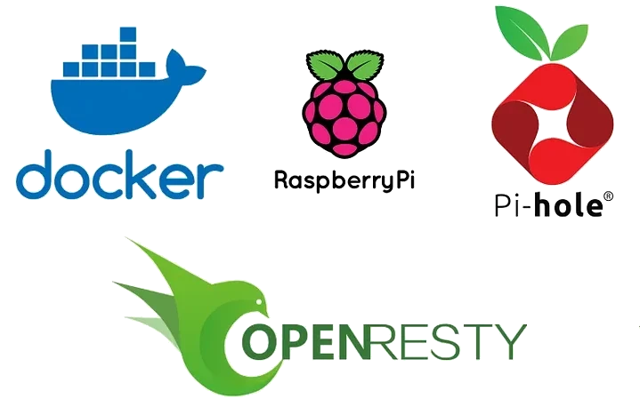
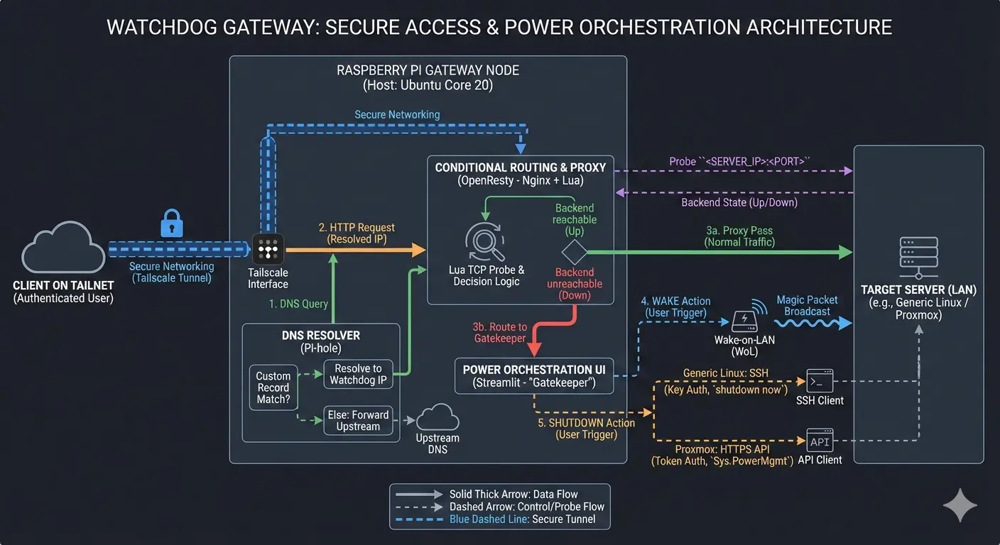

## Introduction

Keeping self hosted infrastructure running continuously can be expensive, especially when the hardware is idle and consuming power without purpose. This was the starting point for *Watchdog*, a minimal and power efficient Raspberry Pi setup that acts as a sentinel for the private cloud environment, booting up critical infrastructure only when required.

But there’s more to it.

Instead of memorising IP addresses or wrestling with Wake on LAN packets, the goal was to create a seamless user experience. Users connect securely via Tailscale, access services using human readable domains, and the gateway handles the routing, authentication, and wake procedures transparently.

## Motivation

The core idea emerged from a simple requirement: save energy by keeping the main servers powered off when not in use, whilst waking them reliably on demand without exposing the intricacies of network protocols to every user.

The Raspberry Pi 3B+, with its ultra low power footprint and reliable continuous uptime, fits the role perfectly as a persistent node. It serves as the Tailscale gateway, DNS resolver, reverse proxy, and most importantly, the orchestration engine that decides when the rest of the infrastructure needs to wake up.

## Architecture Overview

* Hardware: Raspberry Pi 3B+
* Containerisation: Docker and Docker Compose
* Network interfaces: Conditional routing via OpenResty (Nginx plus Lua), split DNS resolution through Pi hole, and secure networking via Tailscale

## Key Components and Workflow

### 1. DNS routing with Pi hole

Pi hole acts as the local DNS resolver. Through a split DNS configuration, it resolves queries for both local area network domains and Tailscale tailnet resources. Instead of remembering raw IP addresses, users simply visit domains like `openwebui.com` or `photoprism.lan`. Furthermore, it blocks advertisements and telemetry network wide to improve privacy and performance.

### 2. Conditional reverse proxy with OpenResty

OpenResty acts as a programmable reverse proxy. Whenever a request for a hosted service is made, the gateway checks if the server node is online. If it is offline, the proxy intercepts the request and redirects the user to Gatekeeper, a web interface providing Wake on LAN control. Once the node boots and the service becomes reachable, the request is transparently forwarded. This abstracts the boot process for end users.

### 3. Dual mode power orchestration

The system accommodates two distinct operational modes for power orchestration. The Linux distribution mode utilises secure SSH with key authentication to shut down standard Linux servers. The Proxmox mode leverages a restricted Proxmox API token for granular power management, eliminating the need for direct SSH access to the hypervisor. Wake on LAN remains the standard for booting offline servers across both modes.

### 4. Security considerations

The system operates in headless mode, with access restricted exclusively to authenticated Tailscale clients. This provides a unified service namespace while preventing direct exposure to the local area network or the public internet. There is no need to open public ports or configure complex router forwarding rules. All services are containerised to limit the attack surface.

### 5. Benefits

* Energy efficient: Keep heavy infrastructure off until it is actively required.
* Security first: No services are publicly exposed; all traffic is authenticated and tunnelled via Tailscale.
* User friendly: No IP memorisation is required; Wake on LAN is handled by a simple interface with human readable service names.

### 6. Future enhancements

* Automated shutdown based on idle detection.
* Integration of Grafana and Loki for monitoring watchdog uptime and behaviour.
* Web dashboard for authenticated service discovery and power control.

## Project Repository

This article outlines the problem Watchdog solves and the methodology behind it. For comprehensive technical details, system architecture documentation, and complete deployment instructions, please refer to the official repository:

[https://github.com/ninja-con-gafas/watchdog](https://github.com/ninja-con-gafas/watchdog)